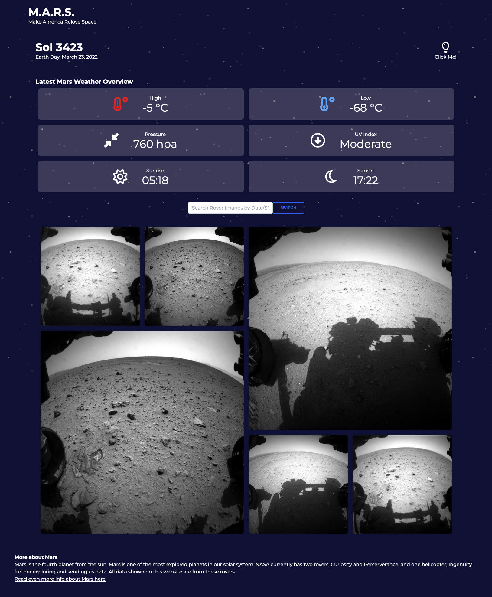

<!-- https://github.com/othneildrew/Best-README-Template -->

<!-- PROJECT LOGO -->
 

  

<h3 align="center">Make America Re-Love Space</h3>

  

    A interactive app allowing you to view the most recent weather data on mars, and also searching a specific sol(martian day) will show you the first 6 images taken from the curiosity rover for that day.
     
     
     
    <a href="https://garrettlockhart.github.io/Make-America-Relove-Space/">View Demo</a>
    ·
    <a href="https://github.com/GarrettLockhart/Make-America-Relove-Space/issues">Report Bug</a>
    ·
    <a href="https://github.com/GarrettLockhart/Make-America-Relove-Space/issues">Request Feature</a>
  

 
 
 

<!-- TABLE OF CONTENTS -->

  
Table of Contents

  <ol>
    <li>
      <a href="#about-the-project">About The Project</a>
        <li><a href="#built-with">Built With</a></li>
    </li>
    <li><a href="#live-site">Live Site</a></li>
  </ol>

 

<!-- ABOUT THE PROJECT -->

## About The Project

This project was done by Noah Thayne, Isaac Tongaonevai, MaKena Christiansen, and Garrett Lockhart. It utilizes the MAAS2 API for the weather data, and also Nasa's very own Mars Rover Photo API. This site serves as an informational hub for some of the more interesting data we can gather from mars, with the goal of making america re-love space!

### Built With

- [HTML5](https://developer.mozilla.org/en-US/docs/Web/HTML)
- [Tailwindcss](https://tailwindcss.com/)
- [JavaScript](https://developer.mozilla.org/en-US/docs/Web/JavaScript)
- [JQuery](https://jquery.com/)
- [Momentjs](https://momentjs.com/)

<!-- CONTRIBUTING -->

## Contributing

Any contributions you make are **appreciated**.

If you have a suggestion that would make this better, please fork the repo and create a pull request. You can also simply open an issue with the tag "enhancement".
Don't forget to give the project a star! Thanks again!

1. Fork the Project
2. Create your Feature Branch (`git checkout -b feature/AmazingFeature`)
3. Commit your Changes (`git commit -m 'Add some AmazingFeature'`)
4. Push to the Branch (`git push origin feature/AmazingFeature`)
5. Open a Pull Request

<!-- CONTACT -->

## Live Site

Project Link: [https://garrettlockhart.github.io/Make-America-Relove-Space/](https://garrettlockhart.github.io/Make-America-Relove-Space/)
 
 

(<a href="#top">back to top</a>)

